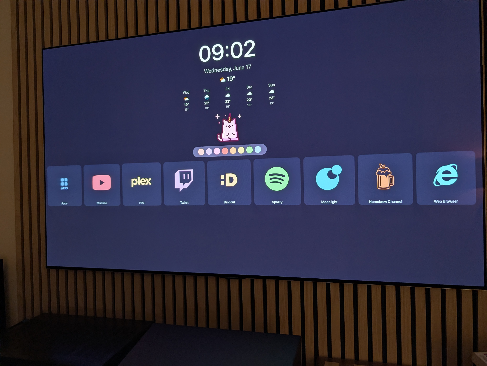

# Custom webOS 23 Home Screen

Catppuccin-themed home screen with clock, weather, and custom app grid.

> [!CAUTION]
> **Vibe-Coded Software Ahead** 
> 
> This project is almost entirely AI generated. While it works on my TV, it may not work on yours.  
> Although no permanent modifications will be made to the home app, please do know what you're doing before using this.

> [!WARNING]
> This project **ONLY** works on WebOS 23. WebOS 24 almost entirely changes the home app, rendering these changes incompatible.




## Features
  - Minimal layout
    - Removed ad shelves
    - Removed input previews
    - Removed search/notifications/settings shortcuts
  - Clock and date
  - Home Assistant provided weather and forecast
  - Custom app grid
  - Custom background image
  - Hide apps
  - Custom app icons
  - Custom app colors
  - Custom app names

## Prerequisites
  - A rooted LG TV running WebOS 23
  - Homebrew Channel

## Quick Start

```bash
cp .env.example .env          # edit with your HA URL + token
./build.sh                    # generates deploy/
scp -r deploy root@<your_tv_ip>:/media/developer/apps/usr/palm/applications/ooo.lew.customhome/
ssh root@<your_tv_ip> "cd /media/developer/apps/usr/palm/applications/ooo.lew.customhome && ./apply.sh"
# Ensure the home screen works, the below command will run the patches on startup
ssh root@<your_tv_ip> "ln -sf /media/developer/apps/usr/palm/applications/ooo.lew.customhome/apply.sh /var/lib/webosbrew/init.d/49-custom-homescreen"
```

## Customization

Edit `UserInterfaceLayer/Containers/config.js`:

- `hiddenAppIds` — apps to hide from the grid
- `displayNames` — rename apps  
- `customIcons` — override app icons (PNG)
- `iconTints` — per-app color overlay (Catppuccin palette)
- `constellationEnabled` — master on/off for the animated background
- `constellation` — background animation options (`scale`, `lineWidth`, `speed`, `alpha`, `nodeColor`, `edgeColor`, `tintFromApp`)

Place custom icons in `assets/icons/`.  
Update the `background.jpg` image to change the background

### In-app editing

Hold the select button on an app tile to open a menu where you can hide/show,
rename, recolour, and re-icon that app. The menu's **Settings** entry opens the
global settings screen: clock (12/24h, AM/PM), weather units, the background
shader (all parameters), auto-hide for newly installed apps, and **Manage all
apps** — which lists every app (including hidden ones) so anything can be
restored, and offers a **Reorder apps** mode (pick up with OK, move in any
direction, OK drops). Everything is saved on the TV (DB8) and takes precedence
over `config.js`, so no rebuild/redeploy is needed — `config.js` stays as the
default/seed. The menu also shows the app's ID.

To enable the AM/PM text on the clock:
Edit [patches/MainView_M.patch](patches/MainView_M.patch:109) and set `visible: true`

## How it works

`apply.sh` copies the TV's *own* original app, applies patches, overlays our custom files, then bind-mounts. Safe across reboots via webosbrew `init.d`.

### Font Attribution
Copyright (c) 2016-2023 The Inter Project Authors
"Inter" is trademark of Rasmus Andersson.
https://github.com/rsms/inter

This Font Software is licensed under the SIL Open Font License, Version 1.1.
See https://openfontlicense.org/ for full terms.
